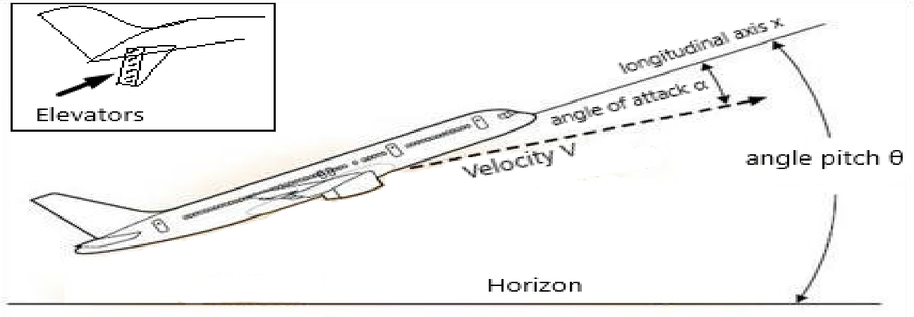

# Intelligent and Adaptive Control Systems: Assignment 2

> The assignment brief as issued by the course staff (academic year 2021-22), translated from Greek. The text, the problem and the picture are from the course brief; only the translation is new. The report that answers it: [report.md](report.md).

The vertical motion of conventional aircraft is controlled by the engine power and by the control surfaces on the tail (elevators). Although the engine power is the primary input for setting the speed, deflecting the elevators up or down by an angle $\delta_e$ changes the pitch rate $q = \dot{\theta}$ of the aircraft and therefore its orientation relative to the horizon (pitch angle $\theta$). At the same time, the moments produced by the elevator deflection also affect the angle of attack $\alpha$ of the aircraft (the angle between the velocity vector $V$ and the longitudinal axis $x$ of the aircraft):

The figure above shows the various quantities. Taking as state variables $x_p = [\alpha, q]^T$, in rad and rad/s respectively, and for a constant aircraft speed measured in ft/s, the dynamic equations that describe the vertical motion for relatively small elevator deflections in rad are:

$$
\dot{x}_p = \underbrace{\begin{bmatrix} -0.8060 & 1 \\ -9.1486 & -4.59 \end{bmatrix}}_{A_p} x_p + \underbrace{\begin{bmatrix} -0.04 \\ -4.59 \end{bmatrix}}_{B_p} \delta_e. \tag{1}
$$

The output $y$ is the angle of attack. To give the controller proportional-integral characteristics, we define $e_y \triangleq y_p - r$, which we integrate by forming the system

$$
e_{y_I} \triangleq \int_0^t e_y(\tau) d\tau.
$$

$e_{y_I}$, together with the state variables, is used to form the feedback.

(a) Implement in MATLAB a linear state-feedback controller with proportional-integral characteristics, such that all signals in the closed loop are bounded and the error $e \triangleq y_p - y_m$ converges to zero. Here $y_m$ is the output of the reference model described in the statement of Assignment 1, and the reference input $r(t)$ is:

$$
r(t) = \begin{cases}
0^\circ & 0 \leq t < 1s \\
0.5^\circ & 1 \leq t < 10s \\
0^\circ & 10 \leq t < 22s \\
-0.5^\circ & 22 \leq t < 32s \\
0^\circ & 32 \leq t < 45s \\
1^\circ & 45 \leq t < 55s \\
0^\circ & 55 \leq t < 65s \\
-1^\circ & 65 \leq t < 75s \\
0^\circ & 75 \leq t < 85s \\
0.5^\circ & 85 \leq t < 95s \\
0^\circ & 95 \leq t
\end{cases} \tag{2}
$$

In the same plot, show the output, the output of the model and the reference input. In a second plot, show the control signal that achieves this result.

(b) Next, assume that the system (1) also contains uncertainties and is described by the state equations

$$
\dot{x}_p = A_p x_p + B_p D(\delta_e + f(x_p)), \tag{3}
$$

with

$$
f(x_p) = k_\alpha \alpha + k_q q.
$$

Choose values of the parameters $D$, $k_\alpha$, $k_q$ such that the closed-loop system with the controller of part (a) is unstable. Show the instability with plots.

(c) For the system (3) and for the values of the parameters $D$, $k_\alpha$, $k_q$ you have chosen (but treating them as unknown), design and implement in MATLAB an adaptive state-feedback controller (see Assignment 1) that keeps the proportional-integral characteristics and makes the output of the controlled system track the output of the reference model (for the reference input (2)).
In your simulation the controller must not use the parameters $D$, $k_\alpha$, $k_q$. In addition to the plots described in part (a), give plots of all signals in the closed loop.

Comment on and interpret your results.
