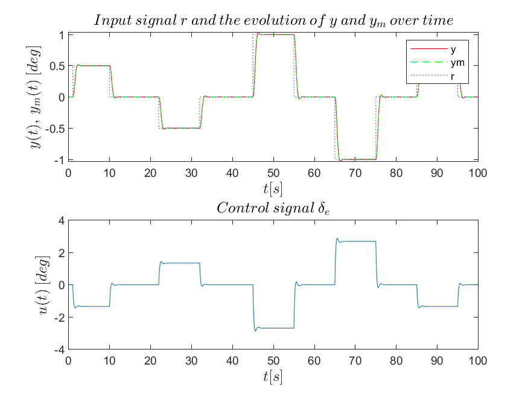
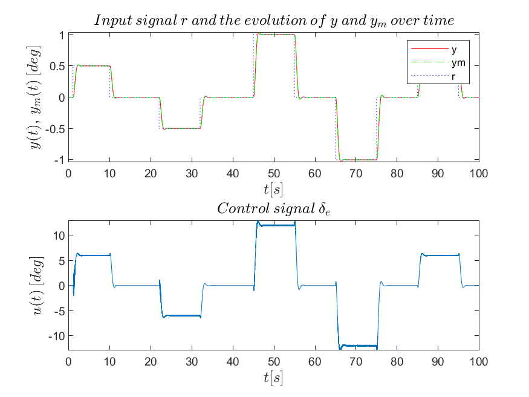
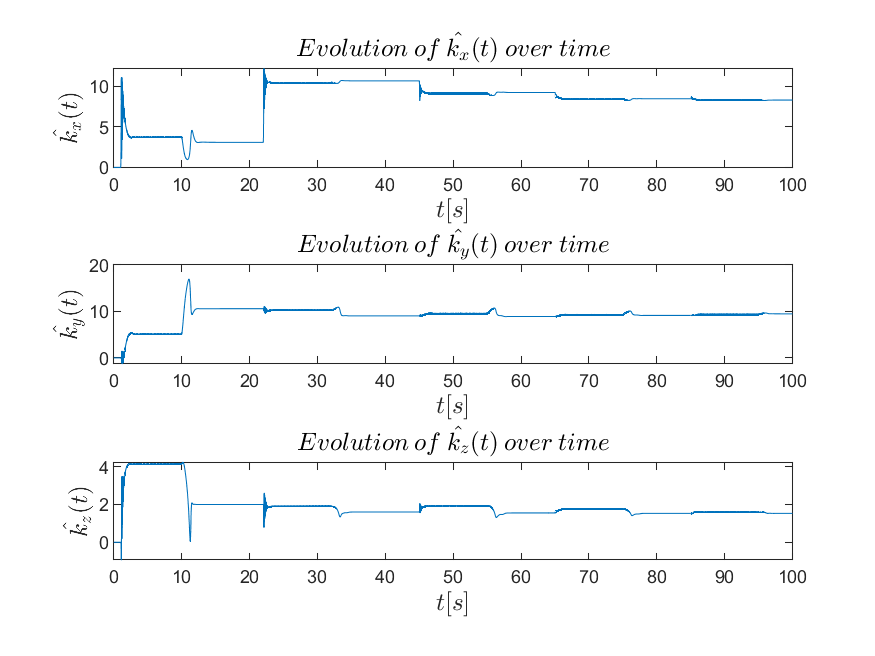
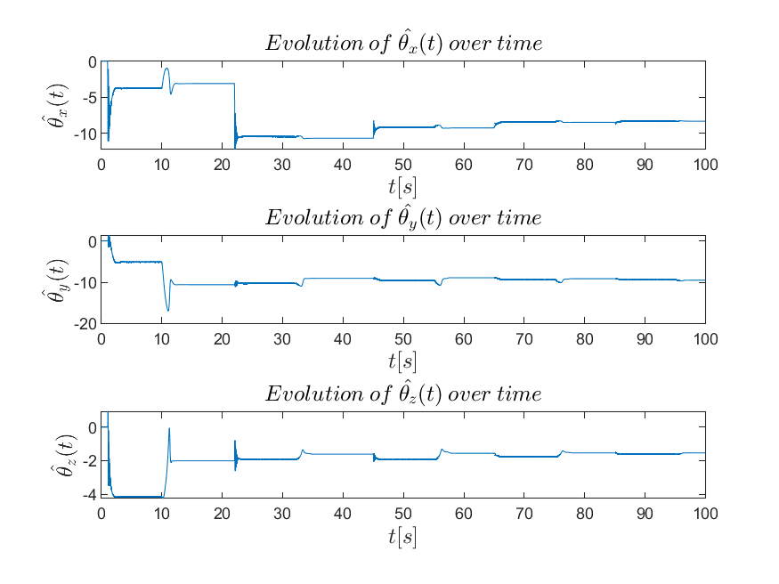
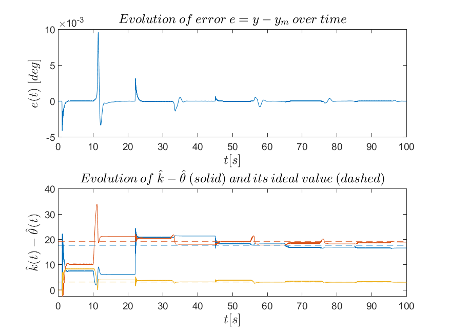

# Assignment 2: Intelligent and Adaptive Control Systems

16 January 2022

The assignment: [brief.md](brief.md). The figures are produced by `src/make_figures.m` (MATLAB R2019a).

Taking as state variables $x_p = [\alpha, q]^T$, in rad and rad/s respectively, and for a constant aircraft speed measured in ft/s, the dynamic equations that describe the vertical motion for relatively small elevator deflections in rad are:

$$
\begin{aligned}
\dot{x_p} = \begin{bmatrix}
-0.8060 & 1 \\
-9.1486 & -4.59
\end{bmatrix} * x_p + \begin{bmatrix}
-0.04 \\
-4.59
\end{bmatrix} * \delta_e \\
y_p = \begin{bmatrix}
1 & 0
\end{bmatrix} * x_p
\end{aligned}
$$

with $A_p = \begin{bmatrix} \frac{Z_a}{V} & 1 + \frac{Z_q}{V} \\ M_a & M_q \end{bmatrix}  = \begin{bmatrix} -0.8060 & 1 \\ -9.1486 & -4.59 \end{bmatrix}$, $B_p = \begin{bmatrix} -0.04 \\ -4.59 \end{bmatrix}$ and $C_p = \begin{bmatrix} 1 & 0 \end{bmatrix}$.

The output $y_p$ is the angle of attack. The brief gives the reference input $r(t)$ in degrees; the simulation converts it to rad, and the plots show angles in degrees. To give the controller proportional-integral characteristics, we define $e_y = y_p - r$ (where $r$ is the reference input given in the brief), which we integrate by forming the system

$$
e_{y_I} = \int\limits_0^t e_y({\tau})d{\tau}
$$

$e_{y_I}$, together with the state variables, is used to form the feedback.

The augmented system with the integrated output tracking error is:

$$
\begin{aligned}
\dot{x} = \begin{bmatrix}
0 & 1 & 0 \\
0 & -0.8060 & 1 \\
0 & -9.1486 & -4.59
\end{bmatrix} * x + \begin{bmatrix}
0 \\
-0.04 \\
-4.59
\end{bmatrix} * \delta_e +
\begin{bmatrix}
-1 \\
0 \\
0
\end{bmatrix} * r \\
y = \begin{bmatrix}
0 & 1 & 0
\end{bmatrix} * x
\end{aligned}
$$

All the matrices that describe the system are known. The pair $(A_p, B_p)$ is controllable, so the pair $(A, B)$ is also controllable.

## 1 Part (a)

To choose a suitable reference system, we can use a linear state-feedback controller. In this way we can satisfy the matching condition between the reference model and the system, $A_m = \left( A + B K^T \right)$, and at the same time give the reference model we build the characteristics we want. For this purpose the LQR method was used. Since the open-loop dynamics were already stable and fairly fast, the following weight matrices were chosen for the LQR method.

$$
Q_{LQR} = \begin{bmatrix}
20 & 0 & 0 \\
0 & 0 & 0 \\
0 & 0 & 0
\end{bmatrix} , R_{LQR} = 0.1
$$

With the resulting gain matrix $K_{LQR} = \begin{bmatrix} 14.142135623730947 & 4.398642429826708 & 0.696409743098341 \end{bmatrix}^T$ we arrive at the desired closed-loop reference model

$$
\begin{aligned}
\dot{x_m} = A_m x_m + B_m r \\
y_m = C_m x_m
\end{aligned}
$$

with $B_m = \begin{bmatrix} -1 \\ 0 \\ 0 \end{bmatrix} , \ C_m = \begin{bmatrix} 0 & 1 & 0 \end{bmatrix}$ and

$$
A_m = \begin{bmatrix}
0 & 1 & 0 \\
-0.565685424949238 & -0.981945697193068 & 0.972143610276066 \\
-64.912402512925040 & -29.338368752904593 & -7.786520720821383
\end{bmatrix}
$$

through the relation $A_m = \left( A + B K_{LQR}^T \right)$.

In the first plot, $y$ is the output of the closed-loop system, $y_m$ is the output of the closed-loop reference model and $r$ is the reference input. In the second plot, $\delta_e = u = K_{LQR} * x$ is the linear state-feedback controller with proportional-integral characteristics. We observe that the outputs $y$ and $y_m$ coincide completely, and that they track the reference input $r$.

## 2 Part (b)

If we assume that the system contains uncertainties and is described by the state equations:

$$
\begin{aligned}
\dot{x_p} = A_p x_p + B_p D ( u + f(x_p)) \\
y_p = C_p^T x_p
\end{aligned}
$$

then the augmented system with the integrated output tracking error is:

$$
\dot{x} = Ax + B D ( u + f(x_p)) +B_m r
$$

with $f(x_p) = k_aa + k_qq$.

If we choose $D = 0.8$, $k_a = -13.7229$ and $k_q = -2.295$, then using the controller of part (a) we get the following closed-loop output:

From the plots we observe that the closed-loop system with the controller of part (a) is unstable, because $y(t)$ grows without bound. On the log scale the growth is a straight line, so it is exponential, and the second plot shows that $y$ leaves $y_m$ right after the first step of $r$.

## 3 Part (c)

In the non-ideal case where $0 < D < 1$ and $f(x_p) = k_aa + k_qq$, we implement the adaptive state-feedback controller designed in Assignment 1:

$$
u = \hat{k}^T x - \hat{\theta}^T {\Phi}(x_p) = \hat{k}^T x - \hat{\theta}^T x = (\hat{k}^T - \hat{\theta}^T) x
$$

with

$$
\begin{aligned}
\dot{\hat{k}} = - {\Gamma}_k x e^T P B \\
\dot{\hat{\theta}} = {\Gamma}_\theta x e^T P B
\end{aligned}
$$

After some trials, the design parameters took the values ${\Gamma}_k = (180/\pi)^2 \begin{bmatrix} 2000 & 0 & 0 \\ 0 & 2000 & 0 \\ 0 & 0 & 200 \end{bmatrix} , \ {\Gamma}_\theta = (180/\pi)^2 \begin{bmatrix} 2000 & 0 & 0 \\ 0 & 2000 & 0 \\ 0 & 0 & 200 \end{bmatrix}$ and $Q = \begin{bmatrix} 100 & 0 & 0 \\ 0 & 100 & 0 \\ 0 & 0 & 100 \end{bmatrix}$ (the matrix $P$ is set indirectly by $Q$ through the Lyapunov equation $P A_m + A_m^T P = -Q$). The matrices were tuned with all signals in degrees. The model states are in rad, and the update laws are quadratic in the signals ($x e^T$), so the same behaviour needs the gains multiplied by $(180/\pi)^2 \approx 3283$.

In the plots above, $y$ is the output of the closed-loop system, $y_m$ is the output of the closed-loop reference model, $r$ is the reference input, and $\delta_e = u =(\hat{k}^T - \hat{\theta}^T) x$ is the adaptive state-feedback controller, which keeps the proportional-integral characteristics and, as we observe, makes the output of the controlled system track the output of the reference model.

The change of the estimate of the gain matrix $K$ over time.

The change of the estimate of the gain matrix $\theta$ over time.

We observe that the tracking error between the controlled system and the reference model converges to zero, so tracking is achieved.

Because $\Phi(x_p) = x$, the controller uses only the difference $\hat{k} - \hat{\theta}$, so only that difference is determined, and $\hat{\theta}$ ends up close to $-\hat{k}$. Matching the closed loop to the reference model gives its ideal value $K_{LQR}/D - \theta = [17.68, 19.22, 3.17]^T$ (dashed in the second plot). The estimate settles near this value but not on it: at $t = 100$ s it is $[16.62, 18.94, 3.06]^T$. Tracking does not need the estimates to reach their ideal values.

The plots also show that all signals in the closed loop are stable, as expected from the analysis above. Moreover, we confirm that $\lim\limits_{t \to \infty} \dot{\hat{k}} = 0$ and $\lim\limits_{t \to \infty} \dot{\hat{\theta}} = 0$, since $\hat{k}$ and $\hat{\theta}$ converge to constant values.
